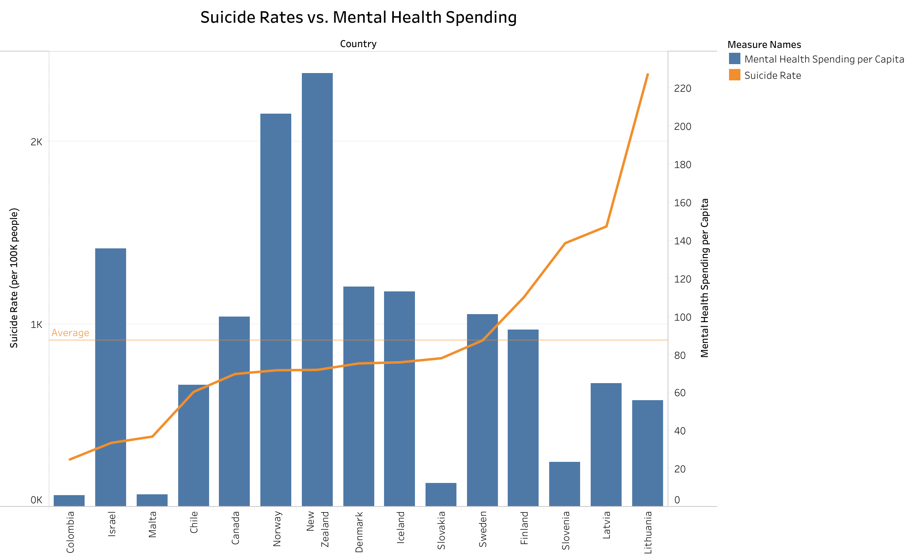
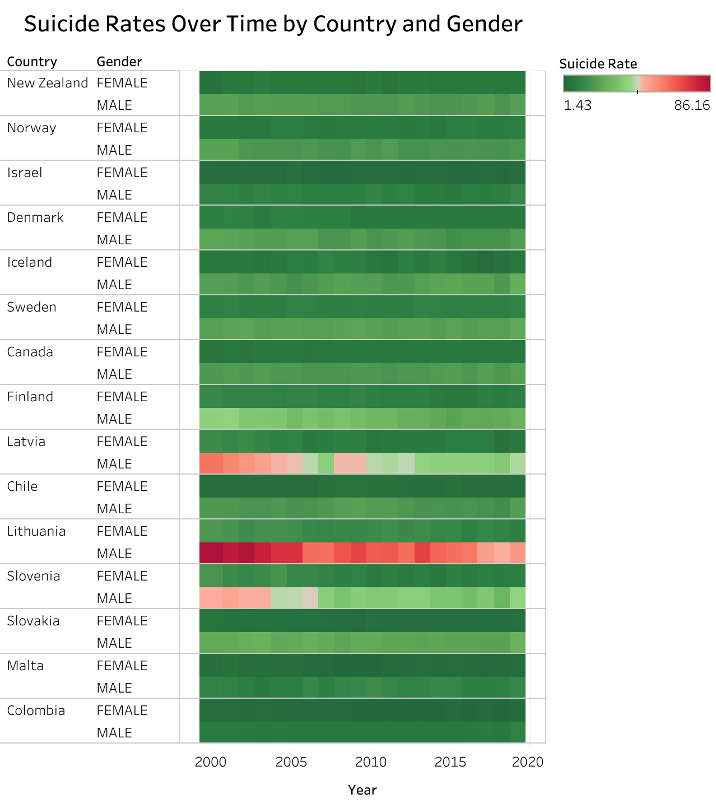

# **Report: Understanding Suicide Rates Through Mental Health Spending & Gender Trends Over Time**

---

### **Introduction**
Mental health and suicide rates remain crucial global concerns, with many countries grappling with how to reduce suicide rates effectively. Despite increased mental health spending in various regions, we see discrepancies between financial investment and outcomes. This report explores the correlation between suicide rates and mental health spending, as well as gender-specific trends over time, using visual data analysis to uncover deeper insights and potential actions.

---

### **1. Suicide Rates vs. Mental Health Spending**

#### **What the Data Shows**:
1. **Spending Does Not Always Correlate with Lower Suicide Rates**:
   - Countries like **Lithuania** and **Latvia** have **high suicide rates** despite significant **mental health spending per capita**. This suggests that financial investments alone are insufficient to curb suicide rates effectively.

2. **Nordic Countries Show Moderate to High Suicide Rates**:
   - Despite being among the top spenders on mental health, countries like **Norway** and **Finland** still struggle with **moderate to high suicide rates**, indicating that societal or structural barriers might be in play.

3. **Diverse Outcomes Despite Similar Spending**:
   - **Malta** and **Israel** exhibit **low suicide rates** with relatively modest spending, while **New Zealand** shows **high suicide rates** despite increased spending. This highlights the role of cultural, societal, and systemic factors beyond pure financial allocation.

#### **Why These Trends?**:
- **Cultural Barriers**: Social stigma around mental health may prevent individuals, especially men, from seeking help even in high-spending countries.
- **Gender-Specific Issues**: Males are more prone to suicide, yet are less likely to seek help, contributing to the higher rates despite available resources.
- **Resource Allocation**: Mental health resources may not be reaching the right populations, making spending less effective.

#### **Actions to Address This**:
1. **Focus on Outcomes, Not Just Spending**: Governments should ensure mental health spending leads to measurable results by focusing on **outcome-based programs**.
   
2. **Gender-Specific Interventions**: Countries should develop **male-focused mental health programs**, acknowledging the higher risk males face and providing accessible, stigma-free support.

3. **Community-Led Mental Health Support**: Invest in **community-driven mental health initiatives** to improve the accessibility and effectiveness of mental health services.

---

### **2. Suicide Rates Over Time by Country and Gender**

#### **What the Data Shows**:
1. **Males Consistently Have Higher Suicide Rates**:
   - Across all countries, **male suicide rates** are higher than female rates, particularly in countries like **Lithuania** and **Latvia**, where the gap is especially stark.

2. **Regional Variance in Suicide Trends**:
   - While some countries like **Finland** have relatively stable suicide rates, others like **Lithuania** and **Slovenia** saw **significant spikes** in the early 2000s, especially among males.

3. **Declining Suicide Rates in Some Countries**:
   - Countries like **Finland** show a **gradual decline** in suicide rates, suggesting that sustained mental health efforts may be contributing to positive trends, even if slowly.

#### **Why These Trends?**:
- **Societal Expectations of Men**: Cultural norms often push men to avoid seeking help, leading to disproportionately higher suicide rates.
- **Economic Stress**: The rise in male suicide rates in countries like **Lithuania** and **Latvia** during the early 2000s may be tied to economic instability.
- **Preventive Interventions**: Countries with declining trends may have implemented early detection and intervention systems, helping to prevent suicides before they occur.

#### **Actions to Address This**:
1. **Target Male-Specific Mental Health Support**: Develop **male-targeted mental health campaigns** that tackle the societal pressures men face and promote seeking help.
   
2. **Expand Early Detection Programs**: Implement **early intervention** systems in schools, workplaces, and community centers to identify and address mental health issues early.

3. **Economic and Mental Health Integration**: For countries with rising suicide rates tied to economic instability, create programs that integrate **mental health support with financial assistance** to alleviate the combined pressures.

---

### **Conclusion**

The data from both graphs reveal that suicide rates are influenced by multiple factors, including **cultural barriers**, **gender-specific challenges**, and **economic conditions**. While mental health spending is necessary, it must be **targeted** and **outcome-focused** to be effective. Moreover, addressing gender disparities and providing early intervention will be critical to reducing suicide rates.

#### **Key Actions**:
1. **Outcome-Based Spending**: Governments should focus on the measurable impact of mental health spending, ensuring resources reach the people who need them most.
   
2. **Gender-Focused Interventions**: Developing **gender-specific mental health support**, especially for men, is essential to reducing suicide rates across countries.

3. **Expand Preventive Measures**: By implementing **early detection and intervention programs**, countries can catch mental health issues before they escalate into crises, particularly among high-risk groups.

---

### **Appendix: Data Cleaning Process**

1. **File Merging**:
   - Suicide rate data from **File 1** was merged with mental health spending data from **File 6** based on the **Country** field to facilitate comparisons.
   
2. **Handling Missing Values**:
   - Countries with missing data on mental health spending were either imputed using average regional values or excluded from relevant analyses.

3. **Gender Grouping**:
   - Data from **File 2** was grouped by **Year**, **Country**, and **Gender**, which allowed us to track the trend of suicide rates across time and analyze gender-specific trends.

---

This report offers key insights and actionable recommendations based on the analysis of suicide rates, mental health spending, and gender disparities. By focusing on **outcome-driven spending**, **gender-specific support**, and **preventive mental health measures**, we can take tangible steps toward reducing suicide rates worldwide.
